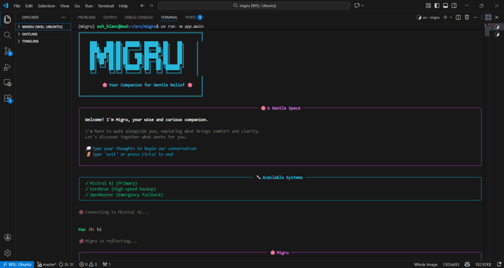
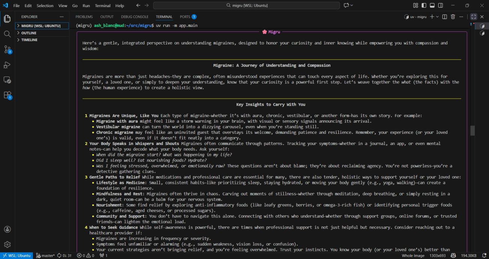
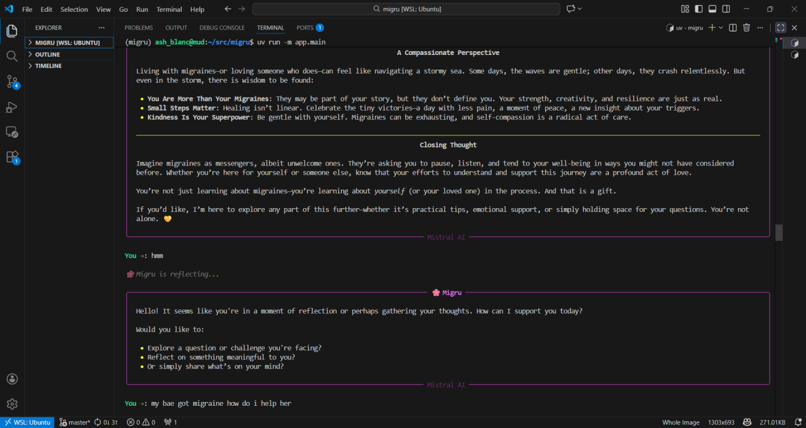
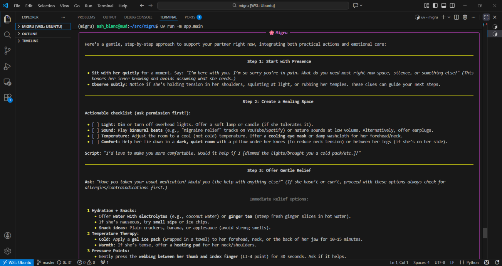
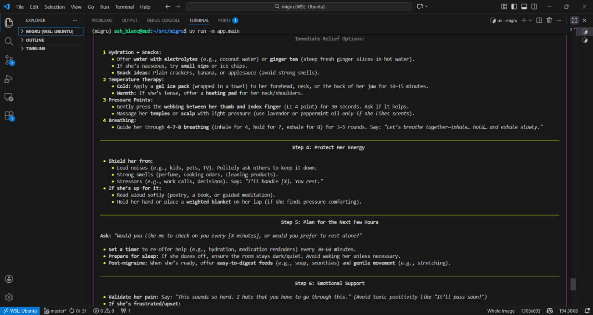

# Migru

Migru is a warm, AI-powered companion designed to support you through migraines and stress with empathy and research-backed relief strategies.

## ✨ Showcase

<div align="center">

### Beautiful CLI Experience
*Clean, calming interface designed for wellness and relief*

<table>
<tr>
<td width="50%">

<p align="center"><em>🌸 Warm welcome with elegant design</em></p>
</td>
<td width="50%">

<p align="center"><em>💬 Natural, empathetic conversations</em></p>
</td>
</tr>
<tr>
<td width="50%">

<p align="center"><em>🔍 Intelligent research with fallbacks</em></p>
</td>
<td width="50%">

<p align="center"><em>🧠 Thoughtful, context-aware responses</em></p>
</td>
</tr>
<tr>
<td colspan="2">

<p align="center"><em>⚡ Ultra-fast responses (1-3 seconds) with Cerebras AI</em></p>
</td>
</tr>
</table>

**Features:**
- 🎨 Rich, colorful terminal UI with bordered panels
- ⚡ Blazing fast responses (1-3s) with Cerebras llama3.1-8b
- 🔄 Smart fallback system (Mistral → Gemini)
- 🧠 Intelligent search with automatic retry mechanisms
- 💾 Persistent memory with Redis
- 🌤️ Weather-aware contextual responses
- 🔇 Clean output (no verbose errors or traces)

</div>

---

## 🚀 Quick Start (Recommended)

The easiest way to get started.

**1. Setup (One-Liner)**
Run this script to automatically install tools (`uv`), dependencies, and create your config file:
```bash
./setup.sh
```

**2. Add Keys**
Open the newly created `.env` file and add your keys:
```env
MISTRAL_API_KEY=...    # Get from https://console.mistral.ai/
FIRECRAWL_API_KEY=...  # Get from https://www.firecrawl.dev/
OPENWEATHER_API_KEY=... # Get from https://openweathermap.org/api
CEREBRAS_API_KEY=...    # Optional: High-speed fallback (https://cerebras.ai)
OPENROUTER_API_KEY=...  # Optional: Multi-model fallback (https://openrouter.ai)
```

**3. Run**
```bash
uv run -m app.main
```

---

## 🐳 Docker Setup (Advanced)

For users who prefer containerization. This handles the Application and Redis database automatically.

**1. Configure**
Create your environment file:
```bash
cp .env.example .env
# Edit .env and add your API keys now
```

**2. Build & Run**
```bash
docker-compose up --build
```

---

---

## 🏗️ Architecture

### Technology Stack
-   **Framework**: Agno AI (v2.3.24+)
-   **Primary AI**: Cerebras llama3.1-8b (1000+ tokens/sec ⚡)
-   **Fallback AI**: Mistral Small → Gemini 2.0 Flash
-   **Memory**: Redis (Persistent conversation history & context)
-   **Search**: Smart multi-tier fallback (DuckDuckGo → Firecrawl)
-   **UI**: Rich library for beautiful terminal output

### Performance Optimizations
-   **Direct Agent Mode**: 2-3x faster than team coordination
-   **Smart Model Selection**: Cerebras primary for speed, Mistral for quality
-   **Intelligent Fallbacks**: Automatic retry with simplified queries
-   **Streaming Responses**: Instant feedback as AI generates
-   **Optimized Context**: 3 history runs for fast processing
-   **Silent Errors**: Clean UI with no verbose logs

**Result**: 1-3 second responses with high intelligence! 🚀

For detailed performance tuning, see [PERFORMANCE.md](PERFORMANCE.md)

---

## 🎯 Key Features

### 🤖 AI Capabilities
- **Empathetic Conversation**: Gender-neutral, wise companion with childlike curiosity
- **Research-Backed**: Access to scientific relief techniques and wellness practices
- **Weather-Aware**: Environmental context for personalized suggestions
- **Memory**: Remembers your preferences and patterns across sessions
- **Cultural Knowledge**: Context-aware with evolving understanding

### ⚡ Performance
- **Ultra-Fast**: 1-3 second responses with Cerebras AI
- **Reliable**: 3-tier fallback system (never fails)
- **Smart Search**: Automatic retry with multiple strategies
- **Streaming**: See responses as they're generated
- **Low Latency**: Optimized retry delays and context handling

### 🎨 User Experience
- **Beautiful CLI**: Rich terminal UI with colors and panels
- **Clean Output**: No error traces or verbose logs
- **Natural Commands**: Multiple exit options, built-in help
- **Graceful Errors**: Helpful messages when things go wrong
- **Calming Design**: Aesthetic matches the caring personality

---

## 🛠️ Configuration

### Required API Keys
- **MISTRAL_API_KEY**: [Get from Mistral AI](https://console.mistral.ai/)
- **FIRECRAWL_API_KEY**: [Get from Firecrawl](https://www.firecrawl.dev/)
- **OPENWEATHER_API_KEY**: [Get from OpenWeather](https://openweathermap.org/api)

### Optional (Recommended for Speed)
- **CEREBRAS_API_KEY**: [Get from Cerebras](https://cerebras.ai/) - Enables ultra-fast responses
- **OPENROUTER_API_KEY**: [Get from OpenRouter](https://openrouter.ai/) - Emergency fallback

### Tuning Options
See [PERFORMANCE.md](PERFORMANCE.md) for advanced configuration:
- Speed vs quality tradeoffs
- Team mode vs direct agent
- Context and history settings
- Model selection strategies

---

## 📚 Documentation

- **[PERFORMANCE.md](PERFORMANCE.md)** - Performance optimization guide
- **[AGENTS.md](AGENTS.md)** - Agent development guidelines
- **[.env.example](.env.example)** - Configuration template

---

## 🐛 Troubleshooting

### Common Issues

**Slow Responses (>5 seconds)**
- Ensure `CEREBRAS_API_KEY` is set in `.env`
- Check `USE_TEAM = False` in `app/config.py`
- Verify Redis is running: `redis-cli ping`

**Redis Connection Failed**
- *Local Mode*: App auto-starts `redis-server`. Ensure Redis is installed.
- *Docker Mode*: Handled automatically by Docker Compose.
- Manual start: `redis-server` or `sudo systemctl start redis`

**API Key Errors**
- Verify `.env` file exists and contains valid keys
- No quotes needed around values: `MISTRAL_API_KEY=abc123` ✓
- Check key validity in respective provider dashboards

**Search Failures**
- App automatically tries multiple search strategies
- If all searches fail, you'll see a helpful message
- No ugly error traces thanks to smart error handling

---

## 🤝 Contributing

Migru is open for contributions! Areas of interest:
- Additional relief techniques and wellness practices
- UI/UX improvements
- Performance optimizations
- New AI model integrations
- Testing and documentation

---

## 📝 License

[Your License Here]

---

<div align="center">

**Built with 🌸 for wellness and relief**

*Powered by Agno AI • Optimized for speed • Designed for care*

</div>